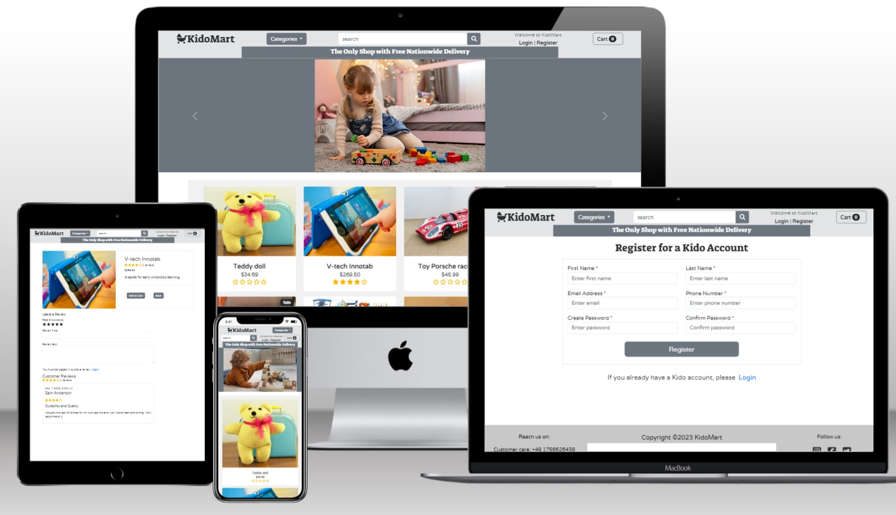
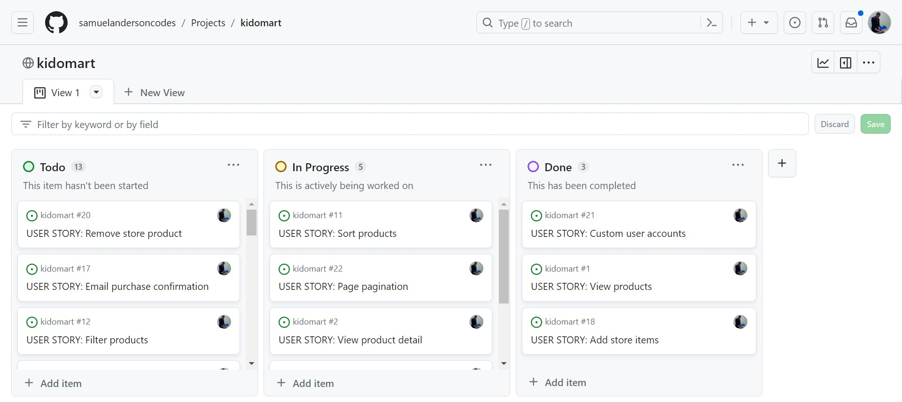
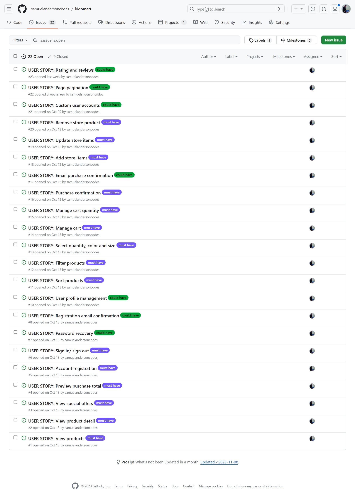

# KidoMart

Kidomart is an e-commerce website that sells a variety of children's products. We give you a wide range of categories consisting of dolls, toys, clothing, electronics, beauty and accessories to choose from. And as part of our inaugurational promotion, we deliver it to your doorstep free of charge.

The live link can be found here: [Live Site - KidoMart](https://kidomart-78f25893d540.herokuapp.com/)

## Table of Contents
- [KidoMart](#kidomart)
  - [Table of Contents](#table-of-contents)
- [User-Experience-Design](#user-experience-design)
  - [The-Strategy-Plane](#the-strategy-plane)
    - [Site-Goals](#site-goals)
    - [Agile Planning](#agile-planning)
      - [Epics](#epics)
      - [User Stories](#user-stories)
  - [The-Scope-Plane](#the-scope-plane)
  - [The-Structure-Plane](#the-structure-plane)
    - [Features](#features)
    - [Features Left To Implement](#features-left-to-implement)
  - [The-Skeleton-Plane](#the-skeleton-plane)
    - [Wireframes](#wireframes)
    - [Database-Design](#database-design)
    - [Security](#security)
  - [The-Surface-Plane](#the-surface-plane)
    - [Design](#design)
    - [Colour-Scheme](#colour-scheme)
    - [Typography](#typography)
    - [Imagery](#imagery)
  - [Technolgies](#technolgies)
  - [Testing](#testing)
  - [Deployment](#deployment)
    - [Version Control](#version-control)
    - [Heroku Deployment](#heroku-deployment)
  - [Credits](#credits)

# User-Experience-Design

## The-Strategy-Plane

### Site-Goals

The website is aimed at providing a platform for parents, wards and children themselves to easily shop online. Registered users are able to easily purchase items ranging from toys to educational essentials online.

Our free inaugral and promotional nation-wide delivery ensures that ordered products with the 'paid' status are rightfully delivered to the associated billing addresses on time.

We look forward to becoming the best seller for children's products.

### Agile Planning

This project was developed using agile methodologies by delivering small features in incremental sprints. There were 9 sprints in total, spaced out evenly over eight weeks.

The kanban issues were assigned to epics and were labelled as 'must have' and 'could have'. They were assigned to sprints based on their level of priority. It was done this way to ensure that core requirements are first taken care of.

The Kanban board was created using github projects and can be located [here](https://github.com/users/samuelandersoncodes/projects/2) Each issue within it consists of a user story, acceptance criteria and tasks that defines the required functionality and its associated tasks to be executed. In total, there were 22 issues. 

### KidoMart Project Board

### KidoMart Issues

#### Epics

The project had 6 main Epics:

**EPIC 1 - Deployment Epic**

The app was first deployed to heroku so that the site is live for users. All dependencies were put in place and thouroughly tested to ensure that the live app is properly set up and has no problems. This epic was implemented first in order to avoid last minute deployment descrepancies. 

**EPIC 2 - Base Setup**

The base setup epic is for all stories needed for the base set up of the application. Without the base setup, the app would not be possible so it was the next epic to be delivered after deployment as all other features depend on it. Here, the home page view, page navigation, product detail views and admin store management were executed.

**EPIC 3 - Registration and User Account**

In the registration and user account epic, user and super user accounts management, user registration, user authentication, password recovery, password recovery email confirmation and user profile management were executed. This epic was very important because shoppers can only make a purchase if they are authenticated. It was therefore considered as the next epic after the base setup.

**EPIC 4 - Product Sorting and Searching Epic**

The Product sorting and searching epic is for all stories related to the product sorting functionality, product categories and the product search functionality. This is very crucial for the grouping of products for easy identification and user search.

**EPIC 5 - Purchasing and Checkout**

The purchasing and checkout epic is for all stories that relate to product purchasing customization, shopping cart management, cart quantity management, checkout summary, order confirmation management, order confirmation email as well as rating and reviews.

**EPIC 6 - Documentation**

This epic is for all documentation related stories and tasks that are needed to document the software development lifecycle of the application. It aims to deliver quality documentation, explaining all stages of development and necessary information on running, deploying and using the application.

#### Sprints

**EPIC 1 - Deployment Epic**

**Sprint 1**

##### User Stories

As a developer I want the application to be deployed on Heroku successfully so that is live and accessible through the Heroku domain.

As a developer, I want the necessary environment variables to be configured on Heroku so that I am sure that all dependencies like AWS s3 bucket, postgresql, stripe and django are properly wired up for the full and overall functionality of the deployed app.

As a developer, I want the application to make use of the ElephantSQL database in the production environment so that all my database schema, tables and its associated data are well structured for data storage and display.

As a developer, I want to configure the application to use AWS S3 so that all static files are safely stored and served.

##### Acceptance Criteria

- The application is successfully deployed on Heroku. The deployed application must be accessible through a Heroku domain.
- All necessary environment variables are configured on Heroku.
- The application seamlessly interacts with the ElephantSQL database on Heroku.
- Static and media files are stored and served from the configured AWS S3 bucket.
- The DEBUG setting is finally set to False.

##### Tasks

- Create a kidomart Github repository.
- Create a Heroku app for kidomart and link it to the kidomart repository on Github.
- Install Django and create the kidomart project.
- Wire up the settings for database, wsgi procfile, middleware, static and media file setups.
- Make the initial commit when the app is set and live.
- Set all necessary environment variables both in the gitpod workspace and in the Heroku settings.
- Ensure that no secret key is commited to the kidomart repository.
- Set up all dependecies for Django, AWS s3 bucket, elephant postgresql, whitenoise, stripe and email host.   
- Ensure the project's dependencies and configurations are compatible with Heroku and all other used dependencies.
- Make regular commits after every bit of significant increment.

**EPIC 2 - Base Setup**

**Sprint 2**

### Product Viewing and Navigation

#### Product Display

##### User Story
As a shopper, I want to see a list of all available products so that I can browse through and make informed purchase decisions.

##### Acceptance Criteria 
- The product list should display product names, images, price and rating.

- There is a drop down menu that displays available categories.

- The page should include a search bar to enable users to search for specific products by name, description or category.

##### Tasks
- Design and implement a responsive product list interface using HTML and CSS.

- Retrieve product data from the database and display it dynamically with Python and Django on the product list page.

#### Product Detail Page

##### User Story

As a shopper, I want to view detailed product information, including descriptions, images, ratings, reviews and pricing, so that I can make informed purchase decisions.

##### Acceptance Criteria

- The product details page should display the product name, description, images, price, ratings, reviews and any available variations of colour and or size.

- The product details page should include a section for customer reviews and ratings.

- Given the product details page, the user should be able to see high-resolution images of the product.

- The product details page should display the product's stock information. Shopper should be informed if a particular product is out of stock.

##### Tasks

- Design and implement a product details page template with a user-friendly layout using HTML and CSS.

- Retrieve and display detailed product information dynamically on the product details page, including product description, images, average rating, reviews and pricing.

- Implement a system to display product variations, if applicable. For instance, size, color and quantity to choose from.

- Develop a feature to enable customers to leave reviews and ratings for purchased products and display them on the product details page.

- Ensure that the product details page is responsive and compatible with various devices and screen sizes.

#### Home Page Pagination

##### User Story

As a site user I want to be able to easily navigate through multiple pages of product listings so that I can find and view the products I am interested in.

##### Acceptance Criteria

- When viewing products or category of products with twelve and eight  products respectively, I should see a pagination component at the bottom of the page.

- The pagination component should display page numbers and navigation controls, such as "PREV" and "NEXT."

- Clicking on a page number should load and display the corresponding set of products on the page.

- The current page should be visually highlighted for good user experience.

- The "PREV" button should be disabled if the user is on the first page and the "NEXT." button should be disabled if the user is on the last page.

Implement logic in the backend to paginate product listings based on  home page products, the selected category or search query.

##### Tasks

- Utilize Django's Paginator mechanism to handle the pagination logic efficiently.

- Create a reusable frontend component for pagination. Ensure the component can dynamically render the page numbers and adjust the display based on the current page and total number of pages.

- Apply appropriate styles to the pagination component for a cohesive and visually appealing design.

- Ensure the pagination is responsive and works well on various screen sizes and devices.

- Ensure that clicking on a page number triggers the appropriate calls to retrieve and display the corresponding products.

- Conduct a thorough test to ensure the pagination component works well without errors.

**Sprint 3**

### Admin Store Management

#### Store Product Stocking 

##### User Story

As a store owner, I want to be able to easily add new items to my store so that I can efficiently keep the product inventory up-to-date.

##### Acceptance Criteria

- The product addition process should include fields for product details, such as name, description, price, images, category, availability status, stock count, color and size variations.

- As an administrator, I want to have the option to categorize the newly added products and assign relevant tags for improved organization and searchability.

- The system should allow the admin to assign categories, color and size variations to the new products for streamlined inventory management.

##### Tasks

- Design and implement an intuitive product addition interface for the admin, including input fields for product details and image upload functionality.
 
- Create a category and tagging system that enables the admin to organize and label products based on specific categories for efficient inventory management.

- Implement input validation and error handling to ensure that the admin can only add complete and accurate product information to the store's inventory.

- Test the product addition and management features thoroughly to ensure their functionality, security, and user-friendliness for the admin interface.

#### Updating Products 

##### User Story
 
As a store owner, I want to be able to update product prices, images and description so that it reflects changes in market trends or business requirements.

##### Acceptance Criteria

- The admin should be able to access a user-friendly product editing page with editable fields for product prices, images, and descriptions.

- Updates should reflect on the respective products accordingly.

##### Tasks

- Design and implement an intuitive product editing interface for the admin, including editable fields for product prices, image uploads and description updates.

- Develop a product management system that securely stores and retrieves product information, allowing the admin to update and revise product details as needed.

- Implement input validation and error handling to ensure that the admin can only make valid and accurate changes to product details within the system.

- Test the product editing and management features rigorously to ensure its intended functionality.

#### Deleting Products 

##### User Story

As a store owner, I want to be able to remove outdated or discontinued products from the store's inventory so that only up-to-date and relevant products are left in the store.

##### Acceptance Criteria

- The store owner should be able to access a product management page with an option to delete products from the store's inventory.

- The product deletion process should include confirmation prompts to prevent accidental deletion of products.

##### Tasks

- Design and implement an intuitive product management interface for the store owner, including a delete option for removing products from the inventory.

- Implement confirmation prompts and safeguards to prevent accidental deletion of products, ensuring that the store owner confirms the deletion action before it is executed.

- Test the product deletion and management features rigorously to ensure the functionality works as expected.

#### Sales Highlighting

##### User Story

As a shopper, I want to easily identify products on promotional sale offer so that I can take advantage of discounted prices.

##### Acceptance Criteria

- The website should prominently display discounted products with visible labels or tags. 

- The sale prices should be clearly indicated on the respective product while the initial price is cancelled out.

##### Tasks

- Design and implement a visually distinct labelling badge for products on sale.

- Test the visibility and effectiveness of the highlighting system with a diverse group of users to ensure its clarity and user-friendliness.

**EPIC 3 - Registration and User Account**

**Sprint 4**

#### Custom User and Super User Accounts Creation and Management

##### User Story

As a developer, I want the ability to create custom users and super users so that I can manage the website's access efficiently to my liking.

##### Acceptance Criteria

- The admin can create a custom user with specified access levels and permissions.
- The admin can create a super user with full access and control over the website.
- Both custom users and super users should have unique login credentials.
- The created users should be able to log in with email as username and a password to perform their designated actions.
- Error handling should be in place for any invalid inputs or unauthorized access attempts.
- Regular users should have no permisions to staff and admin operations.
- The system should maintain a secure database of all users and their respective access levels.
- All user should be able to update their respective user details.

##### Tasks

- Design the user interface for the admin to create custom users.
- Develop the backend logic to handle custom user creation requests and store them securely in the database.
- Implement authentication and authorization mechanisms for login credentials.
- Create fields for the admin and regular users to input their necessary details.
- Define access levels and permissions for both custom users and super users.
- Test the user creation functionality for both custom users and super users, ensuring all acceptance criteria are met.
- Implement error handling to display appropriate messages for invalid inputs or unauthorized access attempts.

#### User Registration

##### User Story

As a site user, I want to easily create a personal account to access personalized features so that I can make future purchases securely and efficiently. 

##### Acceptance Criteria

- The registration process should require basic information such as name, email address, phone number, address lines 1 and 2, country, state, city, password and confirm password.

- The registration process should include input validation and error handling to ensure that all required fields are filled out correctly.

##### Tasks

- Design and implement a user-friendly registration interface with clear and responsive input fields using HTML and CSS.

- Develop a secure authentication system to store user credentials and encrypt sensitive information, such as passwords.

- Implement input validation and error handling to prompt users to correct any incomplete or inaccurate information during the registration process.

- Conduct thorough testing to ensure that the registration process is smooth, secure, and user-friendly across different devices and platforms.

#### Registration Email Activation

##### User Story

As a site user, I want to receive an email confirmation upon registration to verify my account so that I can ensure registration success.

##### Acceptance Criteria:

- The system should send an automated email with a secure account activation link to the user's registered email address.

- The email should contain a user-friendly message with a prominent call-to-action link for account activation.

- The email confirmation should provide clear instructions and guidance on how to verify the account and complete the registration process.

##### Tasks

- Configure the system to trigger an automated email with a secure account activation link to the user's registered email address upon successful registration.

- Design and create an email template that includes clear instructions and a user-friendly interface for account verification and actvation.

- Implement a mechanism to track the status of email confirmations and update the user account status upon successful verification.

- Conduct rigorous testing to ensure that the email activation system functions correctly and that users can verify their accounts seamlessly.

- Provide appropriate error handling to assist users who encounter issues with the email activation process.

#### User Authentication

##### User Story

As a returning customer, I want to be able to log in quickly and securely so I can access my personalized account settings and order history.

##### Acceptance Criteria

- The login process should require a valid email address and password.

- Given the login page, the user should be able to enter their valid credentials and access their account dashboard upon successful authentication.

- The logout process should clear any active user sessions and provide a confirmation message to the user upon successful logout.

##### Tasks

- Design and implement a visually appealing and user-friendly login page with input fields for email and password using HTML and CSS.

- Develop a secure authentication system to verify user credentials and grant access to the account dashboard upon successful login.

- Implement a clear and straightforward logout button all pages to enable users to log out from any page of the website.

- Configure the system to clear any active user sessions and remove any locally stored user data upon successful logout.

- Test the login and logout processes rigorously to ensure their security, usability, and responsiveness across various devices and browsers.

#### Password Recovery

##### User Story

As a user, I want the option to reset my password easily if I forget it, so that I can regain access to my account and protect my profile and data.

##### Acceptance Criteria

- The password recovery process should involve verifying the user's identity through a secure method such as email verification.

- The system should send an email verification link through which the respective user can change their password while they concurrently verify their identity.

- The password reset process should prompt the user to create a new password and provide confirmation upon successful password update.

##### Tasks

- Design and implement a user-friendly password recovery link on the login page with HTML and CSS.

- Develop a secure password reset system that sends a reset link to the user's registered email address.

- Configure the system to validate user input and ensure that the provided information matches the account details before allowing a password reset.

- Implement necessary security measures, such as expiration links for reset requests and limitations on the number of password reset attempts within a specific time frame.

- Test the password recovery process rigorously to ensure its reliability, security, and user-friendliness across different devices and browsers.

**Sprint 5**

#### User Profile Management

##### User Story

As a site user, I want to create a personal profile so that I can easily view my  order confirmation and history as well as save my billing information.

##### Acceptance Criteria

- The profile creation process should include fields for users to input their personal details, such as first and last names, email address, profile picture, address lines, phone number, country, state and city.
 
- The system should allow users to edit and modify their profile information, with appropriate validation and error handling.

- Only registered users have access to create a user profile by editing their profile on the dashboard sidebar.

##### Tasks

- Design and implement a user-friendly profile creation interface with input fields for first and last names, email address, profile picture, address lines, phone number, country, state and city.

- Develop a user profile management system that stores and retrieves user data securely and efficiently into the database.

- Create a an edit button on the dasboard that will enable users to update their profile information.

- Implement data validation and error handling to ensure that the user-provided information is accurate and meets the required criteria.

- Test the user profile feature thoroughly to ensure its functionality, security, responsiveness and user-friendliness across different devices.

**EPIC 4 - Product Sorting and Searching**

**Sprint 6**

#### Product Sorting functionality

##### User Story

As a shopper, I want the ability to sort the list of products by category so that I can easily find products in my preferred category.

##### Acceptance Criteria

- The product sorting functionality should enable users to arrange products by category.

- The product sorting functionality should be responsive and provide users with a seamless experience across different devices and screen sizes.

##### Tasks

- Design and implement a user-friendly product sorting interface that allows users to from various categories.

- Develop a sorting mechanism that rearranges the product list based on the selected category.

- Integrate a responsive design approach to ensure that the product sorting functionality is user-friendly and responsive on all screen sizes.

- Conduct comprehensive testing to validate the accuracy and efficiency of the product sorting feature, checking for any potential bugs or performance issues.

#### Product Search Functionality

##### User Story

As a shopper, I want to be able to search for products by their names or description so that I can easily find specific products of my preference.

##### Acceptance Criteria

- The search functionality should provide relevant product results and search item counts based on the user's input.

- The system should return accurate search results that matches the keywords found in the product descriptions and or name.

- In exceptions where the search found no result, The user should be informed of that no results was found for their respective search.  

- The search functionality should be responsive and provide users with a seamless experience across different devices and screen sizes.

##### Tasks

- Design and implement a user-friendly search bar interface that allows users to enter search queries.

- Develop a search mechanism that retrieves and displays relevant products based on the user's input and matches the search query with product names and descriptions.

- Integrate a responsive design approach to ensure that the search functionality is accessible and user-friendly on all screen sizes.

- Conduct a comprehensive testing to validate the accuracy and efficiency of the product search feature, checking for any potential bugs or performance issues.

**EPIC 5 - Purchasing and Checkout**

**Sprint 7**

#### Product Purchasing Customization

##### User Story

As a shopper, I want to be able to select the size and or quantity of a product to ensure that it fits my preferences and needs.

##### Acceptance Criteria

- The product coluor and size options should be clearly presented on the product detail page.

- Users should be able to select the desired  quantity, color and size of the product from the available sizes and colour options provided by the system.

- The product selection interface should enable users to increment and or reduce their desired quantity of the product and display the updated tax and total price based on the selected quantity.

##### Tasks

- Design and implement a user-friendly product customization that retrieves and displays available quantity colour and size options and enables users to select their preferred  quantity, colour and size before checking out.

- Integrate input validation and error handling to ensure that users can only select valid size options and input a valid quantity within the specified range.

- Test the product customization feature thoroughly to ensure its functionality, responsiveness and compatibility across different devices and screen sizes.

**Sprint 8**

#### Shopping Cart Management

##### User Story

As a shopper, I want to view all the items in my shopping cart so that I can ensure that my order is accurate before making a purchase.

##### Acceptance Criteria

- The shopping cart page should display a comprehensive list of all the items added to the cart, including their names, prices, quantity, colour and size variations if applicable.

- The shopping cart page should include options to update quantities, remove items, or continue shopping.

- The shopping cart page should provide clear instructions and options for users to edit quantities, remove items, or proceed to checkout as needed.

##### Tasks

- Design and implement a user-friendly shopping cart interface that displays a list of all added items and their corresponding details.

- Develop a shopping cart management system that allows users to update quantities, remove items or continue shopping seamlessly.

- Implement a tax and total cost calculation feature that dynamically updates the total cost based on the selected items and quantities in the shopping cart.

- Integrate a responsive design approach to ensure that the shopping cart interface is accessible, responsive and user-friendly on all screen sizes.

- Test the shopping cart functionality rigorously to ensure its accuracy and compatibility across different devices and screen sizes.

