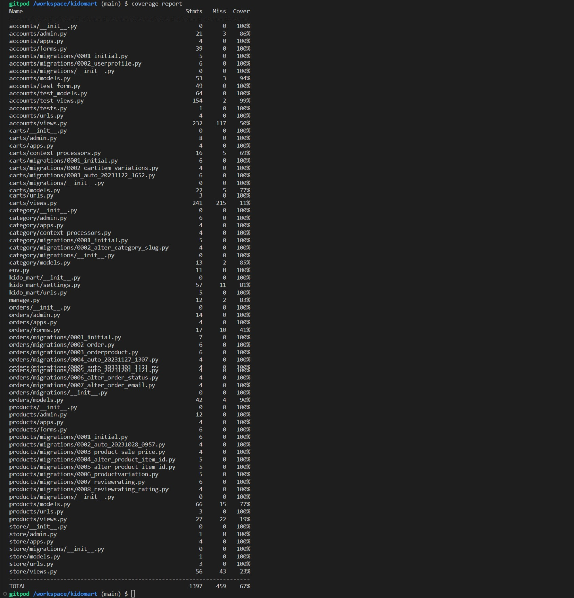
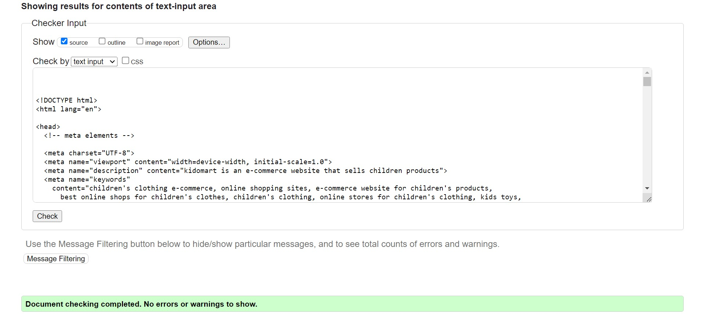

## Testing

## Functional Testing

**Registration**

Description:

Ensure a user can successfully register on the Kidomart e-commerce website.

Steps:

1. Navigate to [KidoMart](https://kidomart-78f25893d540.herokuapp.com/) and click on the "Register" link.
2. Enter your details in the registration form (All fields are required):

- First Name: John
- Last Name: Doe
- Email Address: john.doe@example.com (must be an active email)
- Phone Number: +1 555-123-4567
- Create Password: Password123
- Confirm Password: Password123

3. Click the "Register" button.

Expected:

An activation email is sent to the user with a secure link to activate their account. Upon clicking the link in the email, user is redirected to the login page with an activation success message.

Actual:

User recieves an activation link via email. After account activation, user is redirected to the login page with a success message confirming the account registration and activation.

**Login**

Description:

Ensure a user can successfully log in to his or her Kido account.

Steps:

1. Navigate to [KidoMart](https://kidomart-78f25893d540.herokuapp.com/) and click on the "Login" link.
2. Enter your details in the registration form (All fields are required):

- Email Address: john.doe@example.com (must be the exact email user registered with)
- Password: Password123 (user's exact password)

3. Click the "Login" button.

Expected:

User is successfully logged in to his or her account dashboard with a login success message.

Actual:

User is successfully logged in to his or her account dashboard with a login success message.

**Logout**

Description:

Ensure a user can log out

Steps:

1. Login to the website
2. Click the logout button from the navbar or on the dashboard side bar

Expected:

User is logged out and a logout success message is displayed.

Actual:

User is logged out and a logout success message is displayed.

**Password Reset**

Description:

Ensure a user can successfully reset their password on the Kidomart website.

Steps:

1. Navigate to the [KidoMart login page](https://kidomart-78f25893d540.herokuapp.com/accounts/login/) and click on the "Forgot Password" link on top of the login button.
2. Verify that the user is redirected to the "Password Reset" page with the heading and instructions.
3. Fill in the email address you registered with and click the "Submit" button.
4. Verify that a verification email is sent to the provided email address.
5. Check the email inbox and click on the verification link in the password reset email.
6. Verify that the user is redirected to the "Password Reset" page.
7. Enter a new password and confirm the new password.
8. Click the "Reset Password" button.
9. Verify that the user is redirected to the login page with a success message indicating the password reset was successful.
10. Log in with the new password to ensure successful login.

Expected:

The user can successfully initiate a password reset from the "Forgot Password" link.
The user receives a verification email and can click the link to reset the password.
After successfully resetting the password, the user is redirected to the login page with a success message.
The user is able to log in with the new password.

Actual:

The user can successfully initiate a password reset from the "Forgot Password" link.
The user receives a verification email and can click the link to reset the password.
After successfully resetting the password, the user is redirected to the login page with a success message.
The user can log in with the new password.

**Change Password**

Description:

Ensure a user can successfully change their password on the Kidomart website.

Steps:

1. Navigate to the [KidoMart Dashboard](https://kidomart-78f25893d540.herokuapp.com/accounts/change_password/) and click on the "Change Password" menu on the the sidebar.
2. Enter your current password.
3. Create new password.
4. Confirem new password. (Make sure the new password is exactly what you enter here)
5. Click on the 'Change' button.

Expected:

After successfully changing the password, the user is redirected to the password change success page. The success page contains a heading and a text indicating the success of the password change.
The user can either log in or go to the home page from the success page by clicking the "Login" or the 'home' button. Logging in with the updated password is successful.

Actual:

After successfully changing the password, the user is redirected to the password change success page. The success page contains a heading and a text indicating the success of the password change.
The user can either log in or go to the home page from the success page by clicking the "Login" or the 'home' button. Logging in with the updated password is successful.

**Edit Profile**

Description:

Ensure a user can successfully update their profile details on the Kidomart e-commerce website.

Steps:

1. Navigate to the [KidoMart Dashboard](https://kidomart-78f25893d540.herokuapp.com/accounts/edit_profile/) and click on the "Edit Profile" menu on the the sidebar.

2. On the profile update page, update the following details try to edit any or all of your profile details:

- First Name
- last Name
- Phone Number
- Profile picture
- Address Line 1
- Address Line 2
- City
- State
- Country

3. Click on the 'Save' button to save your update.

Expected:

User profile is successfully updated. User is redirected to the same page with an update success message and the updated details.

Actual:

User profile is successfully updated. User is redirected to the same page with an update success message and the updated details.

**My orders**

Description:

Ensure a user can successfully view their order details and history on the Kidomart website.

Steps:

1. Navigate to the [KidoMart Dashboard](https://kidomart-78f25893d540.herokuapp.com/accounts/my_orders/) and click on the "My Orders" menu on the the sidebar.

- Alternatively, the 'View Orders' link in the 'Your orders' section of the Dashboard also leads to the the 'My Orders' page upon clicking it.

2. On the 'My Orders' page, you will find the order number, full name, phone number, order total, and ordered date. Click on the order number to view the order invoice or details of that particular order.

Expected:

User has access to and are able to view their order history anytime they want.

Actual:

Users have access to their order history and details and can view it anytime.

**Delete Account**

Description:

Ensure a user can successfully delete their account on the Kidomart website.

Steps:

1. Navigate to the [KidoMart Dashboard](https://kidomart-78f25893d540.herokuapp.com/accounts/delete_account/) and click on the "Delete Account" menu on the the sidebar.

2. On the account deletion confirmation page, carefully review the informationon the page.

3. Confirm deletion of your account by clicking the 'Delete Account' button.

Expected:

User is first logged out and redirected to the register page with an account deletion success message after the account is deleted.

Actual:

User is first logged out and redirected to the register page with an account deletion success message after the account is deleted.

**Add to Cart and Product Variation Selection**

Description:

Ensure a user can successfully add an item and its associated variations (colour and or size) to cart on the Kidomart website.

Steps:

1. Navigate to the [KidoMart](https://kidomart-78f25893d540.herokuapp.com/) and click on the any of the product's name or image.

- This redirects you to the [KidoMart product detail page](https://kidomart-78f25893d540.herokuapp.com/category/clothing/coll-unisex-jacket/) of that particular product.

2. In the item card, click on the 'Choose color' button to select a color and the 'Choose Size' button to select a size (if the item has variation(s)).

3. Then click on the add to cart button.

Expected:

Selected product is added to the cart with the specified color and size.

Actual:

Expected:

Selected product is added to the cart with the specified color and size.

**Cart Item Quantity Increment and Decrement**

Description:

Ensure a user can successfully increment cart item and decrement cart item on the Kidomart website.

Steps:

1. Navigate to the [KidoMart Cart Page](https://kidomart-78f25893d540.herokuapp.com/cart/)

2. Click on the '-' button to decrease item quantity or click on the '+' button to increase item quantity.

Expected:

Upon clicking the '-' button, the quantity of the item reduces by one and upon clicking the '+' button, the quantity of the item increments by one indicating that the test passed.

Actual:

Upon clicking the '-' button, the quantity of the item reduces by one and upon clicking the '+' button, the quantity of the item increments by one.

**Cart Item Removal**

Description:

Ensure a user can successfully remove cart item on the Kidomart website.

Steps:

1. Navigate to the [KidoMart Cart Page](https://kidomart-78f25893d540.herokuapp.com/cart/)

2. Click on the 'Remove' button under Actions.

- Alternatively, user can click on the '-' button till quantity reaches zero.

Expected:

Cart Item is successfully removed showing that the test passed.

Actual:

Cart Item is successfully removed.

**Checkout**

Description:

Ensure a user can successfully checkout on the Kidomart website.

Steps:

1. Navigate to the [KidoMart Checkout Page](https://kidomart-78f25893d540.herokuapp.com/cart/checkout/)

2. Fill out the field in the form;

- First Name
- Last Name
- Phone Number
- Profile picture
- Address Line 1
- Address Line 2
- City
- State
- Country
- Leave a Note (optional)
- Card details (any of the stripe test card numbers(eg; 4242424242424242 4/24/242/42424))

3. Click on the 'Complete Order' button.

Expected:

User is redirected to the checkout success page which contains an invoice of their purchase with a success message that informs them on the success of their order and payment showing that the test passed.

The user also recieves a purchase confirmation email with his or her purchase details.

Actual:

User is redirected to the checkout success page which contains an invoice of their purchase with a success message that informs them on the success of their order and payment. The user also recieves a purchase confirmation email with his or her purchase details.

**Search Bar**

Description:

Ensure a user can search for an item in the search bar of the Kidomart website.

Steps:

1. Navigate to [KidoMart](https://kidomart-78f25893d540.herokuapp.com/)

2. Type a valid search query into the search bar in the middle of the navbar.

3. Press the "Enter" key or click the search icon to initiate the search.

4. Check if the search results are displayed on the page.

5. Verify that the displayed results match the search query.

6. If no results are found, confirm that a message is displayed indicating the no search result found.

Expected:

If a search item is found, it is displayed on the page with its associated search count. When no item is found for a particular search, there is a clear message that says "Sorry! we do not have this item yet". Therefore, the test passed for this functionality.

Actual:

If a search item is found, it is displayed on the page with its associated search count. When no item is found for a particular search, there is a clear message that says "Sorry! we do not have this item yet"

**Category Sorting**

Description:

Ensure a user can sort products by category on the Kidomart website.

Steps:

1. Navigate to [KidoMart](https://kidomart-78f25893d540.herokuapp.com/)

2. Click on the 'Categories' dropdown button.

3. Select a category by clicking on it.

4. Check if the products are sorted by that category with the category heading on top of it.

Expected:

Products are sorted by the selected category with the category heading on top of it and the item count is also displayed. This passes the test.

Actual:

Products are sorted by the selected category with the category heading on top of it and the item count is also displayed.

**Newsletter Subscription**

Description:

Ensure a user can subscribe to newsletters on the Kidomart website.

Steps:

1. Navigate to [KidoMart](https://kidomart-78f25893d540.herokuapp.com/)

2. Locate the newsletter form at the bottom of the page in the footer part.

3. Enter a valid email address.

4. Click on the 'Subscribe' button.

5. Check for the user's email in the 'Audience' section of the Mailchimp dashboard.

Expected:

User is successfully subscribed to the Mailchimp newsletter and a "thank you for subscribing" message is displayed. The user's email is added to the 'Audience' section of the Mailchimp dashboard indicating that the test passed.

Actual:

User is successfully subscribed to the Mailchimp newsletter and a "thank you for subscribing" message is displayed. The user's email is added to the 'Audience' section of the Mailchimp dashboard.

**Footer**

Testing was performed on the footer links by clicking the font awesome icons and ensuring that the instagram icon opened the kidomart instagram handle in a new tab, the facebook icon opened the kidomart facebook handle in a new tab and the twitter icon also opened the kidomart twitter handle in a new tab. These behaved as expected.

## Negative Testing

Tests were performed to ensure that:

1. Forms cannot be submitted when required fields are empty.

2. Error handling has been fully implemented to take care of all possible errors during the payment process. Tests have been carried out to ensure that in cases where there are hitchtes or interruptions during the payment process, the user is assured of accurate updates on their payment status and they are informed about what precisely transpired during the payment process.

## Unit Testing

Unit tests were carried out to test core functionality in some forms, template views, models and redirects to make sure these core parts of the app is thoroughly tested to its bits.

Results:

## Accessibility

[Wave Accessibility](https://wave.webaim.org/) tool was used throughout development and for final testing of the deployed website to check for any aid accessibility testing.

Testing was focused to ensure the following criteria were met:

- All forms have associated labels or aria-labels so that this is read out on a screen reader to users who tab to form inputs
- Color contrasts meet a minimum ratio as specified in [WCAG 2.1 Contrast Guidelines](https://www.w3.org/WAI/WCAG21/Understanding/contrast-minimum.html)
- Heading levels are not missed or skipped to ensure the importance of content is relayed correctly to the end user
- All content is contained within landmarks to ensure ease of use for assistive technology, allowing the user to navigate by page regions
- All non textual content had alternative text or titles so descriptions are read out to screen readers
- HTML page lang attribute has been set
- Aria properties have been implemented correctly
- WCAG 2.1 Coding best practices being followed

## Validator Testing

All pages were run through the [w3 HTML Validator](https://validator.w3.org/). Initially there were some warnings and errors due to stray script tags, misuse of anchor tags within buttons and some improperly closed elements. All of these issues were corrected and all pages passed validation.

Due to the django templating language code used in the HTML files, these could not be copied and pasted into the validator and due to the secured views, pages with login required or a secured view cannot be validated by direct URI. To test the validation on the files, open the page to validate, right click and view page source. Paste the raw html code into the validator as this will display only the HTML rendered code.

